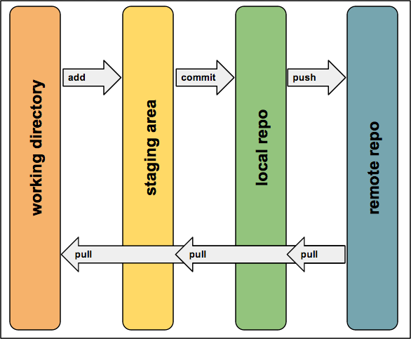

## Links para estudo
- [Guia Rápido](https://rogerdudler.github.io/git-guide/index.pt_BR.html)
- [Git book](https://pt.wikiversity.org/wiki/Git_B%C3%A1sico)
- [Vídeo Aulas]("https://www.youtube.com/playlist?list=PLInBAd9OZCzzHBJjLFZzRl6DgUmOeG3H0") Assista dos vídeos de 1 até o 4.
- [Curso com certificado](https://www.schoolofnet.com/curso/git)
- [Tutorial com branchs](https://medium.com/trainingcenter/plano-para-estudar-git-e-github-enquanto-aprende-programa%C3%A7%C3%A3o-f5d5f986f459)

### Ações
- Clonar um repositório externo
    - `git clone url`
- Atualizar a sua pasta do repositório local com as modificações do repositório externo
    - `git pull origin master`

## Fluxo de trabalho

Seus repositórios locais consistem em três "árvores" mantidas pelo git. A primeira delas é sua `Working Directory` que contém os arquivos vigentes. A segunda `Index` (stage) que funciona como uma área temporária e finalmente a `HEAD` (repositório local) que aponta para o último `commit` (confirmação) que você fez.

## Instalação
- Windows
    - [Git for Windows](https://gitforwindows.org/)
    - utilize o aplicativo `Git Bash` que será instalado.
- Ubuntu
    - sudo apt install git

## Configuração Inicial
- `git config --global user.name "seu nome"`
- `git config --global user.email "seu email"`

Se estiver utilizando a máquina do laboratório, lembre de configurar pelo menos o email.

## Adicionar & Confirmar

- Você pode propor mudanças (adicioná-las ao Index) usando algum dos seguintes comandos
  - `git add <arquivo>`
  - `git add *`
  - `git add .`
- Este é o primeiro passo no fluxo de trabalho básico do git. Para realmente confirmar estas mudanças (isto é, fazer um commit), use
    - `git commit -m "comentários das alterações"`
- Agora o arquivo é enviado para o HEAD, mas ainda não para o repositório remoto.
- Para visualizar seus "saves" no repositório local use
    - `git log`

## Trabalhando remotamente
- Se você clonou o repositório remoto com o comando `git clone`, ele já está vinculado ao repositório remoto. Se ainda não clonou, mas já criou seu repositório local com `git init`, você pode fazer o vínculo com o comando:
    - `git remote add origin <servidor>`
- Se você já vinculou os repositórios, pode enviar seus commits utilizando
    - `git push origin master`

## Conflitos
- Se estiver trabalhando com várias máquinas, ao acessar uma máquina e tentar dar o commit, o git vai avisar que já existem atualizações remotas. Lembre de sempre dar o `git pull origin master` antes de trabalhar numa nova pasta.
- Se existem conflitos e você quer sobrescrever o repositório remoto com o que existe no repositório local você pode fazer um `git push origin master --force`.

## Ignorando arquivos
- Crie um arquivo `.gitignore` no root no repositório e adicione quais tipos de arquivos você não quer que sejam rastreados pelo git.

## Desfazendo alterações e vendo diferenças
- Pode pode ver as diferenças com o comando `git diff nome_do_arquivo`.
- Pode desfazer as últimas alterações utilizando `git checkout -- nome_do_arquivo`.

